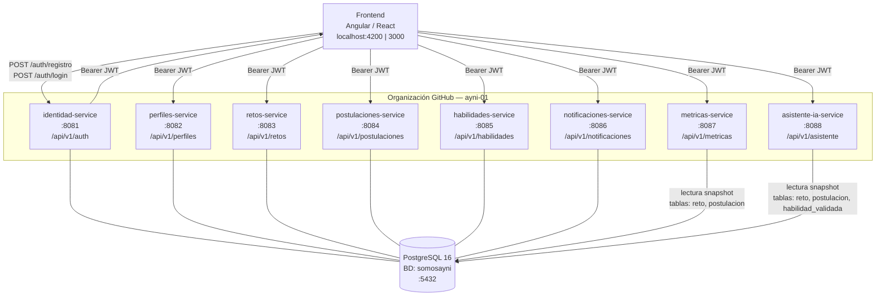
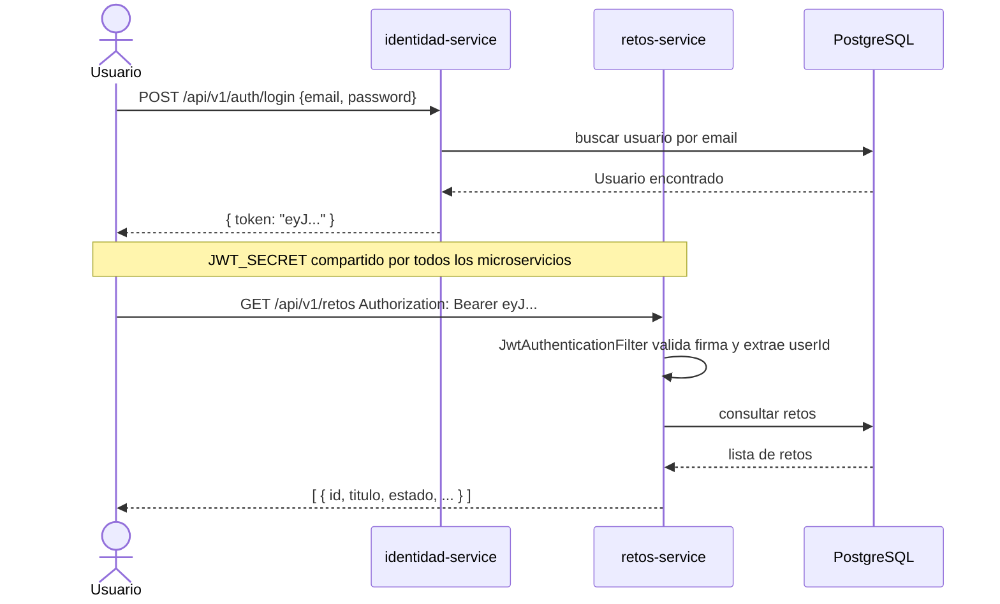
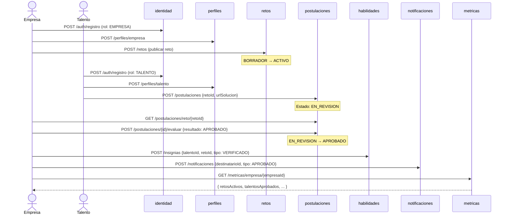

# Somos Ayni — Backend

**Somos Ayni** es una plataforma web de empleabilidad juvenil peruana que conecta talento joven con empresas medianas y grandes del Perú. El diferenciador clave frente a plataformas tradicionales es el sistema de **retos prácticos**: los candidatos resuelven desafíos reales en lugar de postular con un CV tradicional, obteniendo insignias validadas y demostrando sus habilidades empíricas.

---

## Arquitectura de Microservicios

El backend está organizado como **8 microservicios independientes**, cada uno con su propio repositorio dentro de la organización [`ayni-01`](https://github.com/ayni-01). Cada servicio es un Bounded Context de DDD con arquitectura hexagonal completa.



---

## Repositorios

| Servicio | Repositorio | Puerto | Descripción |
|---|---|---|---|
| **identidad-service** | [ayni-01/ayni-identidad-service](https://github.com/ayni-01/ayni-identidad-service) | 8081 | Autenticación JWT, registro y login |
| **perfiles-service** | [ayni-01/ayni-perfiles-service](https://github.com/ayni-01/ayni-perfiles-service) | 8082 | Currículum digital de talentos y empresas |
| **retos-service** | [ayni-01/ayni-retos-service](https://github.com/ayni-01/ayni-retos-service) | 8083 | Publicación y ciclo de vida de retos |
| **postulaciones-service** | [ayni-01/ayni-postulaciones-service](https://github.com/ayni-01/ayni-postulaciones-service) | 8084 | Candidaturas y evaluaciones |
| **habilidades-service** | [ayni-01/ayni-habilidades-service](https://github.com/ayni-01/ayni-habilidades-service) | 8085 | Gamificación: insignias y habilidades |
| **notificaciones-service** | [ayni-01/ayni-notificaciones-service](https://github.com/ayni-01/ayni-notificaciones-service) | 8086 | Alertas centralizadas del sistema |
| **metricas-service** | [ayni-01/ayni-metricas-service](https://github.com/ayni-01/ayni-metricas-service) | 8087 | Analítica y embudos de conversión |
| **asistente-ia-service** | [ayni-01/ayni-asistente-ia-service](https://github.com/ayni-01/ayni-asistente-ia-service) | 8088 | Asistente de IA: consultas sobre retos, recomendaciones de aprendizaje y feedback de soluciones (Spring AI + OpenRouter) |

---

## Flujo de Autenticación JWT



---

## Flujo de Negocio Principal



---

## Arquitectura Interna de Cada Servicio

Todos los microservicios siguen **Arquitectura Hexagonal (Clean Architecture)** con **DDD**:

```
src/main/java/com/somosayni/[servicio]/
│
├── [Servicio]Application.java          ← Entry point Spring Boot
│
├── domain/                             ← Lógica de negocio pura (sin frameworks)
│   ├── model/                          ← Agregados, Enums, Records
│   └── repository/                     ← Interfaces de dominio
│
├── application/                        ← Casos de uso (CQRS)
│   ├── command/                        ← Operaciones de escritura
│   ├── query/                          ← Operaciones de lectura
│   └── port/                           ← Interfaces para infraestructura
│
└── infrastructure/                     ← Adaptadores técnicos
    ├── config/                         ← JWT, Security, CORS, OpenAPI
    ├── persistence/
    │   ├── entity/                     ← Entidades JPA
    │   ├── mapper/                     ← *RepositoryImpl (adaptadores)
    │   └── repository/                 ← JpaRepository interfaces
    └── rest/                           ← Controllers + DTOs

src/main/java/com/somosayni/shared/     ← Copiado en cada servicio
├── domain/model/
│   ├── AggregateRoot.java
│   ├── BaseEntity.java
│   └── ValueObject.java
└── infrastructure/config/
    ├── CorsConfig.java
    └── OpenApiConfig.java
```

---

## Seguridad JWT

- **Firmado por:** `identidad-service` con HMAC-SHA256
- **Verificado por:** los otros 6 servicios (misma `JWT_SECRET`)
- **Claims:** `sub` (userId), `email`, `rol`, `iat`, `exp` — expiración 24h
- **Header:** `Authorization: Bearer <token>`
- **Fix de seguridad:** `JwtAuthenticationFilter` sobreescribe el header `X-User-Id` desde el token validado, impidiendo suplantación de identidad por parte del cliente

---

## Estrategia de Base de Datos

Todos los servicios comparten la misma instancia PostgreSQL (`somosayni`). Cada servicio gestiona sus propias tablas:

| Servicio | Tablas | `ddl-auto` |
|---|---|---|
| identidad | `usuario` | `update` |
| perfiles | `perfil_talento`, `perfil_empresa` | `update` |
| retos | `reto`, `reto_requisito`, `reto_entregable` | `update` |
| postulaciones | `postulacion`, `evaluacion` | `update` |
| habilidades | `insignia`, `habilidad_validada` | `update` |
| notificaciones | `notificacion` | `update` |
| metricas | _(sin tablas propias — solo lectura snapshot)_ | `none` |
| asistente-ia | _(sin tablas propias — solo lectura snapshot)_ | `none` |

> `metricas-service` usa entidades JPA de solo lectura que mapean las tablas `reto` y `postulacion` sin modificarlas.

---

## Variables de Entorno

Todos los servicios requieren estas variables (valor idéntico de `JWT_SECRET` en los 8; `ayni-asistente-ia-service` además requiere `OPENAI_API_KEY`):

```env
JWT_SECRET=somosayni-jwt-secret-key-que-debe-ser-muy-larga-para-hs256-algoritmo-seguro
DB_USERNAME=somosayni
DB_PASSWORD=somosayni123
```

---

## Levantar Todo Localmente

### 1. Base de datos compartida

```bash
docker run -d \
  --name ayni-postgres \
  -e POSTGRES_DB=somosayni \
  -e POSTGRES_USER=somosayni \
  -e POSTGRES_PASSWORD=somosayni123 \
  -p 5432:5432 \
  postgres:16-alpine
```

### 2. Orden de inicio recomendado

```bash
# 1. identidad primero (define el contrato JWT)
cd ayni-identidad-service && mvn spring-boot:run &

# 2. servicios independientes (en paralelo)
cd ayni-perfiles-service      && mvn spring-boot:run &
cd ayni-retos-service         && mvn spring-boot:run &
cd ayni-habilidades-service   && mvn spring-boot:run &
cd ayni-notificaciones-service && mvn spring-boot:run &

# 3. postulaciones (necesita que retos esté activo)
cd ayni-postulaciones-service && mvn spring-boot:run &

# 4. metricas al final (lee tablas de retos y postulaciones)
cd ayni-metricas-service && mvn spring-boot:run &

# 5. asistente-ia al final (lee tablas de retos, postulaciones y habilidades)
cd ayni-asistente-ia-service && mvn spring-boot:run &
```

### 3. Swagger UI por servicio

| Servicio | URL |
|---|---|
| identidad | http://localhost:8081/swagger-ui.html |
| perfiles | http://localhost:8082/swagger-ui.html |
| retos | http://localhost:8083/swagger-ui.html |
| postulaciones | http://localhost:8084/swagger-ui.html |
| habilidades | http://localhost:8085/swagger-ui.html |
| notificaciones | http://localhost:8086/swagger-ui.html |
| metricas | http://localhost:8087/swagger-ui.html |

---

## Herramientas de desarrollo

| Recurso | Link |
|---|---|
| **Postman Collection (todos los servicios)** | [somos-ayni-microservices.postman_collection.json](https://github.com/ayni-01/.github/blob/main/somos-ayni-microservices.postman_collection.json) |
| **Swagger UI identidad** | http://localhost:8081/swagger-ui.html |
| **Swagger UI perfiles** | http://localhost:8082/swagger-ui.html |
| **Swagger UI retos** | http://localhost:8083/swagger-ui.html |
| **Swagger UI postulaciones** | http://localhost:8084/swagger-ui.html |
| **Swagger UI habilidades** | http://localhost:8085/swagger-ui.html |
| **Swagger UI notificaciones** | http://localhost:8086/swagger-ui.html |
| **Swagger UI métricas** | http://localhost:8087/swagger-ui.html |
| **Swagger UI asistente-ia** | http://localhost:8088/swagger-ui.html |

> La colección Postman tiene carpetas separadas por servicio, variables compartidas (`TOKEN_EMPRESA`, `TOKEN_TALENTO`, `RETO_ID`, etc.) y scripts que auto-rellenan tokens e IDs al ejecutar los requests de registro/login.

---

## Stack Tecnológico

| Tecnología | Versión |
|---|---|
| Java | 21 |
| Spring Boot | 3.2.5 |
| Spring Security + JWT (jjwt) | 0.12.5 |
| Spring Data JPA + Hibernate | incluido en Boot |
| PostgreSQL | 16 |
| Springdoc OpenAPI (Swagger) | 2.5.0 |
| Docker & Docker Compose | — |

---

## Roadmap

- [ ] **API Gateway** (Spring Cloud Gateway) — punto de entrada único para el frontend
- [ ] **Service Discovery** (Eureka) — registro dinámico de instancias
- [ ] **Mensajería asíncrona** (Kafka) — eventos de dominio entre servicios
- [ ] **CI/CD** (GitHub Actions) — build y deploy automático por servicio
- [ ] **Migraciones de BD** (Flyway) — reemplazar `ddl-auto: update` en producción
- [ ] **Separación de BDs** — una base de datos por servicio para aislamiento total
